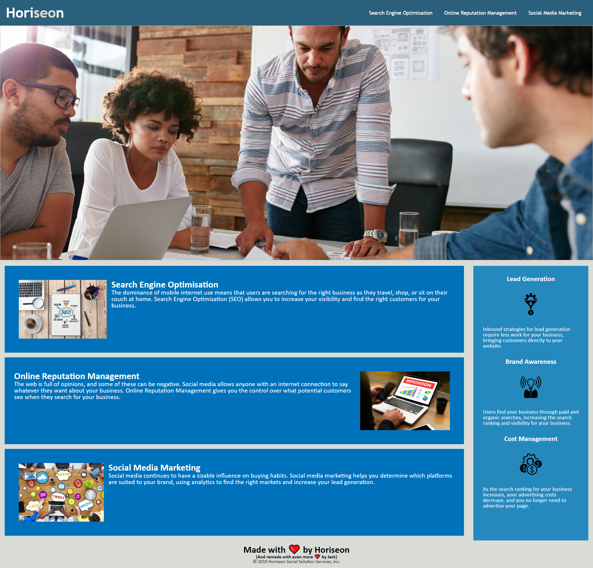
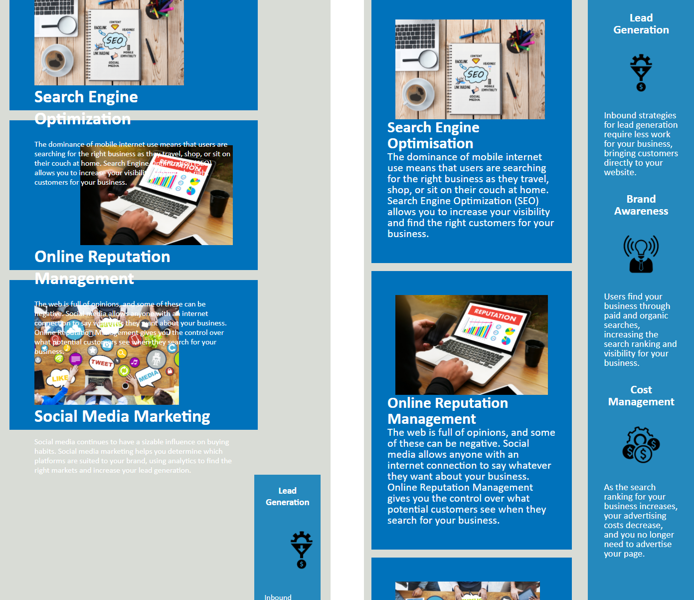
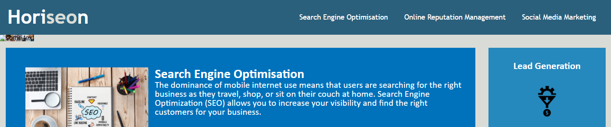

# Redesigning a website to make it more accessible

This repository showcases a site which has been redesigned to include accessibility features and correct element semantics.

The internet is used for lots of things, one fundamental example being to disseminate information or "content" in its many forms. For a lot of us, we consume this online content visually -- but for others that may not be the case. 

When we talk about website accessibility, what we mean is content that can be understood by as many people as possible. So, how can we do that? We can give meaning to our content by wrapping it in semantic elements. 
This lets the browser know whether that line of text is a header, a paragraph, or actually a navigation bar, for example. Text-to-speech tools are better able to function when this metadata is included with a website's content.

## What did I do to improve the accessibility

I have gone through the HTML and replaced the majority of div elements (which tell us nothing about their content) with appropriate semantic elements.

These elements are also structured logically, by which I mean we expect to see a header at the top of the page (or section) and a footer at the bottom. 

## Other changes I made

The site was originally created with floating elements, which don't hold up too well under narrow viewports. I have redesigned the site using flexboxes, which has provided some more responsiveness. A single media query has also allowed this page to be viewable on tablets, however
I feel a more rigourous redesign would be required to make the site phone-friendly. Throughout the redesign I tried to stay mindful of *The law of the instrument*, and I would like to learn more about when to use what features. "Should I make this with a flexbox, or would float be better?" I imagine this sort of intuition will come with practice.

## Any issues?

Mainly a lot of back-and-forth with CSS not doing what I expect it to. Again I feel this will come with more experience. 

I encountered an issue whilst trying to make the hero image (the background picture) accessible. The CSS `alt` property is not recognised by Chrome, so I attempted to add this to an img element instead, however this had the effect of shrinking the picture almost completely. Also, just using an img element without the alt text created a very thin white border around the picture. 

